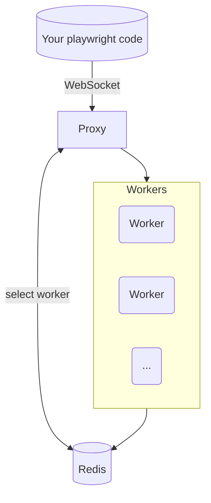

# playwright-distributed

## What is playwright-distributed?
A self-hosted, **distributed browser pool** powered by [Playwright](https://playwright.dev/). It exposes **one WebSocket endpoint** that hands you a ready-to-use browser session while transparently load-balancing between headless browser workers.

* 🔌 **Plug & play** – spin up a proxy + any number of workers; no extra services required besides Redis.
* 🏗️ **Infrastructure-agnostic** – works on any VPS or bare-metal machine; scale horizontally by adding workers.
* 🔒 **Private by default** – keep your data and traffic inside your own network.

---
## Get started
```bash
$ git clone https://github.com/your_org/playwright-distributed.git
$ cd playwright-distributed
$ docker compose up -d   # brings up proxy, 1 worker, Redis
# Now, grab a browser: ws://localhost:8080 is now your Playwright endpoint
```
Stop it with `docker compose down`.

---
## Why playwright-distributed?
| Use-case | What you get |
|----------|--------------|
| **AI / LLM agents** | Give each agent an isolated browser with zero startup cost. |
| **Web scraping / data collection** | Crawl at scale; add workers to raise throughput, remove them to save money. |
| **CI end-to-end tests** | Parallelise test runs across many browsers and cut build times dramatically. |
| **Synthetic monitoring** | Continuously exercise critical user journeys from multiple regions. |
| **Shared “browser-as-a-service”** | One endpoint for your whole team – no more local browser zoo. |

---

## Requirements

* Docker, Docker Compose

## Running

### Local (quick start)
Use Docker Compose as shown above - great for local development and small setups.

### Production
Run each component (proxy, Redis, worker) as an independent service via Docker. This gives you finer control over scaling and upgrades.

Production checklist:
- **Networking:**
  - Workers must reach Redis to register & send heartbeats.
  - Proxy must reach Redis to discover workers.
  - Proxy must reach workers via the endpoints they register in Redis.
- **Exposure:** expose **only the proxy**. There's no need to expose Redis and workers. The stack is not yet security-hardened for public exposure.
- **Scaling:** add or remove workers at will; the proxy will automatically balance load.

---
## Example usage
### Node.js
```js
import { chromium } from 'playwright';

const browser = await chromium.connect('ws://localhost:8080');
// Always create a fresh context for full isolation between sessions
const context = await browser.newContext();
const page = await context.newPage();
await page.goto('https://example.com');
console.log(await page.title());
await browser.close();
```

### Python
```python
from playwright.async_api import async_playwright
import asyncio

async def main():
    async with async_playwright() as p:
        browser = await p.chromium.connect('ws://localhost:8080')
        # Always create a fresh context for full isolation between sessions
        context = await browser.new_context()
        page = await context.new_page()
        await page.goto('https://example.com')
        print(await page.title())
        await browser.close()

asyncio.run(main())
```

> These are just two samples — **any Playwright-compatible client (Java, .NET, Go, Rust, etc.) can connect to the same `ws://localhost:8080` endpoint.**

---
## Architecture



Components:
* **Proxy** – single public endpoint; chooses the worker with the fewest active sessions.
* **Workers** – Playwright browser servers registering themselves & sending heartbeats.
* **Redis** – lightweight coordination (no persistent DB required).

### How sessions are handled
* **One connection ⇢ one context** – every incoming WebSocket connection gets its **own fresh browser context** inside a long-lived Chromium instance. This keeps cookies, localStorage and other state isolated between sessions.
* **Concurrent sessions** – each worker can serve multiple contexts in parallel (configurable; default ≈ 5). The proxy’s Lua script always picks the least-loaded worker.
* **Lifetime cap & recycling** – after a worker has served a configurable number of total sessions (default ≈ 50), it shuts itself down. Combined with Docker’s `--restart unless-stopped` policy this gives you automatic recycling, freeing leaked memory and clearing browser cache with zero manual intervention.

---
## Current state
* **Alpha quality** – not battle-tested in prod yet.
* **Chromium-only** – Firefox & WebKit support coming.
* **No graceful proxy shutdown** – active sessions drop if the proxy stops.
* Looking for feedback & contributors – PRs welcome! 🚀
