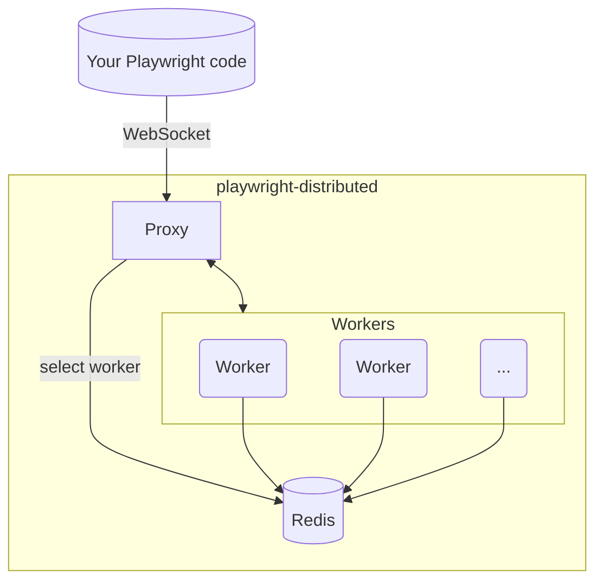

<p align="center">
  
</p>

<h1 align="center">playwright-distributed</h1>

<p align="center">
  <strong>Self-hosted, horizontally-scalable <a href="https://playwright.dev/">Playwright</a> grid.</strong><br/>
  Spin up as many browser workers as you need on your own infrastructure and access them through a single WebSocket endpoint.
</p>

<p align="center">
  <a href="LICENSE"></a>
</p>

---

## Why use playwright-distributed?
- Single WebSocket endpoint routes each session through a smart selector that balances load *and* staggers worker restarts.
- Warm browser instances (Chrome, Firefox, WebKit) - no waiting for browser startup.
- Each connection gets a fresh, isolated browser context.
- Stateless design: add or remove workers at any time; Redis is the only shared component.
- Works with any Playwright client.

### Motivation

Modern teams often need **many concurrent browsers**: scraping pipelines, AI agents, CI test suites, synthetic monitors… Spawning a fresh headless browser for every task wastes tens of seconds and huge amounts of memory. Existing SaaS grids solve this but:

1. You may not want to ship data to a third-party cloud.
2. Vendor pricing scales linearly with sessions.
3. Latency to a remote grid quickly adds up.

`playwright-distributed` lets you run **your own grid** with Docker-simple deployment:

- Keep data on your infrastructure.
- Pay only for the compute you actually run (add/remove workers on demand).
- Share one endpoint across languages, teams and use-cases.


## 🚀 Quick Start (Local)

```bash
# 1. Grab the repo
git clone https://github.com/mbroton/playwright-distributed.git
cd playwright-distributed

# 2. Fire it up (proxy + 1 Chrome worker + Redis)
docker compose up -d
```

Connect from your code:

```js
import { chromium } from 'playwright';

const browser = await chromium.connect('ws://localhost:8080');
const context = await browser.newContext();
const page = await context.newPage();
await page.goto('https://example.com');
console.log(await page.title());
await browser.close();
```

> Want Firefox or WebKit? Append `?browser=firefox` or `?browser=webkit` to the WebSocket URL and use the matching Playwright client (`p.firefox.connect`, `p.webkit.connect`, etc.).
That's it! The same `ws://localhost:8080` endpoint works with any Playwright client (Node.js, Python, Java, .NET, etc.).


## 🛠 Use Cases

| Scenario | Benefit |
|----------|---------|
| **AI / LLM agents** | Give each agent an isolated browser with zero startup cost. |
| **Web scraping / data collection** | Crawl at scale; add workers to raise throughput, remove them to save money. |
| **CI end-to-end tests** | Parallelise test runs across many browsers and cut build times dramatically. |
| **Synthetic monitoring** | Continuously exercise critical user journeys from multiple regions. |
| **Shared “browser-as-a-service”** | One endpoint for your whole team – no more local browser zoo. |


## ⚙️ Production Deployment

Run each component (proxy, Redis, workers) as independent services (Docker/K8s). Checklist:

- **Networking**
  - Workers ➜ Redis (register, heartbeats)
  - Proxy ➜ Redis (worker discovery)
  - Proxy ➜ Workers (WebSocket forward)
- **Exposure** – expose **only the proxy**.
- **Scaling** – add or remove workers freely; the proxy always chooses the next worker according to the staggered-restart algorithm.


## 🔒 Secure Redis Connections

For production deployments, secure your Redis connection with password authentication and TLS encryption.

### Password Authentication Only

**Proxy:**
```yaml
environment:
  - REDIS_HOST=redis-host
  - REDIS_PORT=6379
  - REDIS_PASSWORD=yourpassword
```

**Worker:**
```yaml
environment:
  - REDIS_URL=redis://:yourpassword@redis-host:6379
```

### TLS Only (Public Certificates)

For managed Redis services with public SSL certificates (AWS ElastiCache, Redis Enterprise Cloud, etc.):

**Proxy:**
```yaml
environment:
  - REDIS_HOST=redis-host
  - REDIS_PORT=6379
  - REDIS_TLS=true
```

**Worker:**
```yaml
environment:
  - REDIS_URL=rediss://redis-host:6379
  # Note: double 's' in rediss:// enables TLS
```

### Password + TLS (Recommended for Production, if you want Separate Services)

Combine both for maximum security:

**Proxy:**
```yaml
environment:
  - REDIS_HOST=master.my-cluster.abc123.use1.cache.amazonaws.com
  - REDIS_PORT=6379
  - REDIS_PASSWORD=my-auth-token
  - REDIS_TLS=true
```

**Worker:**
```yaml
environment:
  - REDIS_URL=rediss://:my-auth-token@master.my-cluster.abc123.use1.cache.amazonaws.com:6379
```

> **Note:** TLS support uses the system CA pool for certificate verification. Self-signed or custom CA certificates are not supported.

### Example: Running Proxy and Workers on Separate Servers

#### Server 1: Proxy (only)

Run the proxy with Docker:

```bash
docker run -d \
  --name playwright-proxy \
  -p 8080:8080 \
  -e REDIS_HOST=master.my-cluster.abc123.use1.cache.amazonaws.com \
  -e REDIS_PORT=6379 \
  -e REDIS_PASSWORD=my-elasticache-auth-token \
  -e REDIS_TLS=true \
  -e MAX_CONCURRENT_SESSIONS=10 \
  -e MAX_LIFETIME_SESSIONS=100 \
  -e LOG_LEVEL=info \
  -e LOG_FORMAT=json \
  ghcr.io/mbroton/playwright-distributed/proxy:latest
```

Or build from source:

```bash
cd proxy
CGO_ENABLED=0 go build -o proxy ./cmd/proxy
./proxy
```

With environment variables:
```bash
export REDIS_HOST=master.my-cluster.abc123.use1.cache.amazonaws.com
export REDIS_PORT=6379
export REDIS_PASSWORD=my-elasticache-auth-token
export REDIS_TLS=true
export LOG_LEVEL=info
./proxy
```

#### Server 2-N: Workers

Run multiple workers pointing to the same Redis cluster:

```bash
docker run -d \
  --name playwright-worker-chromium-1 \
  -e REDIS_URL=rediss://:my-elasticache-auth-token@master.my-cluster.abc123.use1.cache.yourcluster.com:6379 \
  -e PORT=3131 \
  -e PRIVATE_HOSTNAME=$(hostname -I | awk '{print $1}') \
  -e BROWSER_TYPE=chromium \
  -e LOG_LEVEL=info \
  -e LOG_FORMAT=json \
  ghcr.io/mbroton/playwright-distributed/worker:latest
```

**Run multiple workers on the same server:**

```bash
# Chromium worker
docker run -d \
  --name worker-chromium \
  -e REDIS_URL=rediss://:TOKEN@host:6379 \
  -e PORT=3131 \
  -e PRIVATE_HOSTNAME=server2-chromium \
  -e BROWSER_TYPE=chromium \
  ghcr.io/mbroton/playwright-distributed/worker:latest

# Firefox worker
docker run -d \
  --name worker-firefox \
  -e REDIS_URL=rediss://:TOKEN@host:6379 \
  -e PORT=3132 \
  -e PRIVATE_HOSTNAME=server2-firefox \
  -e BROWSER_TYPE=firefox \
  ghcr.io/mbroton/playwright-distributed/worker:latest
```

### Connecting from Your Application

Once deployed, connect to the proxy from anywhere:

```js
import { chromium } from 'playwright';

const browser = await chromium.connect('ws://your-proxy-server:8080');
const page = await browser.newPage();
await page.goto('https://yoursite.com');
await browser.close();
```

## Vertical Scaling

Use Docker Compose to run multiple workers:

```bash
# Scale up to 10 workers (chromium)
docker compose up -d --scale worker=10

# Scale down to 5 workers
docker compose up -d --scale worker=5

# Scale multiple browser types
docker compose up -d --scale worker=5 --scale worker-firefox=3 --scale worker-webkit=2
```

**Capacity calculation:**
- Each worker handles `MAX_CONCURRENT_SESSIONS` (default: 5) simultaneous browser contexts
- Total capacity = `workers × MAX_CONCURRENT_SESSIONS`
- Example: 10 workers × 5 sessions = **50 concurrent browsers**

### Horizontal Scaling

Either use Kubernetes for orchestration, or run as follows:

#### Server 1: Proxy + Redis (only)

```yaml
# docker-compose.yml on Server 1
services:
  redis:
    image: redis:8.0
    ports:
      - "6379:6379"  # Expose to private network only, no password needed
    networks:
      - private-network

  proxy:
    image: ghcr.io/mbroton/playwright-distributed/proxy:latest
    environment:
      - REDIS_HOST=redis
      - REDIS_PORT=6379
    ports:
      - "8080:8080"
    networks:
      - private-network

networks:
  private-network:
```

```bash
cd server1
docker compose up -d --scale worker=5
```

#### Server N+1: Run Workers (same setup per server)

```yaml
# docker-compose.yml on Server 2
services:
  worker:
    image: ghcr.io/mbroton/playwright-distributed/worker:latest
    environment:
      - REDIS_URL=redis://server1-ip:6379  # Point to Server 1's Redis
      - PORT=3131
      - PRIVATE_HOSTNAME=${HOSTNAME}  # Must be resolvable by proxy
```

```bash
cd server2
docker compose up -d --scale worker=10
```

### Network Requirements

For workers on separate servers to connect to the proxy:

1. **Redis accessibility**: Workers must reach Redis (Server 1's port 6379)
2. **Worker accessibility**: Proxy must reach workers' WebSocket endpoints
3. **PRIVATE_HOSTNAME**: Must resolve to an IP address accessible by the proxy
   - Use internal IPs (e.g., `10.0.1.50`) for same VPC/data center
   - Use DNS names if available
   - Use public IPs for cross-region (not recommended - adds latency)

All workers automatically discover each other through Redis. Add or remove workers at any time without restarting the proxy.

### Monitoring Capacity

Check current active connections via the proxy metrics endpoint:

```bash
curl http://proxy-host:8080/metrics
# {"activeConnections": 42}
```

Calculate remaining capacity:
```
remaining = (total_workers × MAX_CONCURRENT_SESSIONS) - activeConnections
```


## 📚 Usage Examples

### Node.js

```js
import { chromium, firefox, webkit } from 'playwright';

// Chromium workers connect without any query parameters.
const browser = await chromium.connect('ws://localhost:8080');
const context = await browser.newContext();
const page = await context.newPage();
await page.goto('https://example.com');
console.log(await page.title());
await browser.close();

// Target Firefox workers explicitly.
const firefoxBrowser = await firefox.connect('ws://localhost:8080?browser=firefox');
await firefoxBrowser.close();

// Or WebKit workers.
const webkitBrowser = await webkit.connect('ws://localhost:8080?browser=webkit');
await webkitBrowser.close();
```

### Python

```python
from playwright.async_api import async_playwright
import asyncio

async def main():
    async with async_playwright() as p:
        # Chromium (default)
        browser = await p.chromium.connect('ws://localhost:8080')
        context = await browser.new_context()
        page = await context.new_page()
        await page.goto('https://example.com')
        print(await page.title())
        await browser.close()

        # Firefox
        firefox = await p.firefox.connect('ws://localhost:8080?browser=firefox')
        await firefox.close()

        # WebKit
        webkit = await p.webkit.connect('ws://localhost:8080?browser=webkit')
        await webkit.close()

asyncio.run(main())
```

> Any Playwright-compatible client can connect to the same `ws://localhost:8080` endpoint.


## 🏗 Architecture



### Session Handling

1. **One connection → One context** – every websocket maps to a unique browser context.
2. **Concurrent sessions** – each worker serves several contexts in parallel.
3. **Recycling** – after serving a configurable number of sessions the worker shuts down; Docker/K8s restarts it, guaranteeing a fresh browser.
4. **Smart worker selection** – the proxy's algorithm keeps workers from hitting their restart threshold at the same time and still favours the busiest eligible worker.


## 🗺️ Roadmap

Here's what's planned for the near future:

- **Documentation:** Create comprehensive guides for deployment (K8s, bare metal) and various use-cases.
- **Testing:** Implement a full test suite to ensure stability and reliability.


## 🤝 Contributing

Found a bug? Have an idea for improvement? PRs and issues are welcome!

## 📜 License

This project is licensed under the [Apache-2.0 License](LICENSE).
